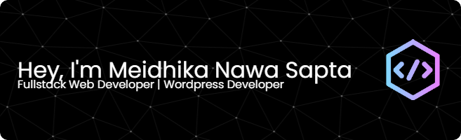

<!-- ### Hello, I'm Meidhika Nawa Sapta -->

<!-- 
#### Skills

#### Connect With Me

 

#### My Github Stats
 -->

#### Hello, I'm Meidhika Nawa Sapta

##### 🌐 Socials:
  

##### 💻 Tech Stack:
         
##### 📊 GitHub Stats:
 
 

##### 🏆 GitHub Trophies

##### 🔝 Top Contributed Repo

---

<!-- Proudly created with GPRM ( https://gprm.itsvg.in ) -->